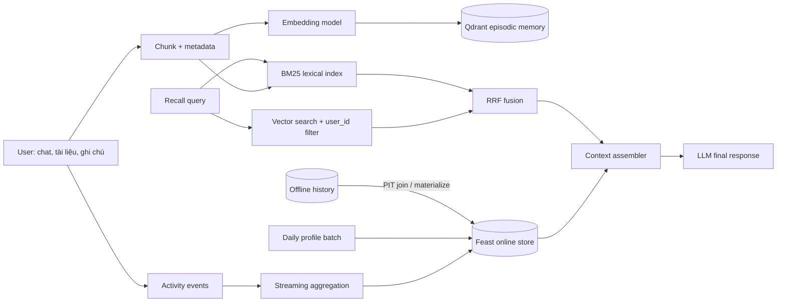

# Hybrid Memory cho trợ lý AI cá nhân Việt Nam

**Contributor:** Trần Văn Thắng  
**Phạm vi:** POC local, không gọi LLM thật; đầu ra là context sẵn sàng đưa vào LLM.

## Kiến trúc và data flow

`remember()` chia nội dung, embed và upsert vào Qdrant với `user_id`, timestamp
và text. `recall()` đọc profile/activity từ Feast, chạy vector search có filter
và BM25 trên memory của user, rồi ghép hạng bằng RRF `1/(60 + rank)`. Context
gồm profile, activity và ba memory tốt nhất trước khi đi vào LLM.

## Quyết định 1 — Chunk theo câu, giới hạn 80 từ

Tôi chọn semantic break ở dấu câu, gom đến tối đa 80 từ và overlap 12 từ. So
với **per-message**, cách này không biến một tin nhắn dài chứa nhiều chủ đề
thành một vector mơ hồ. So với **per-conversation**, chunk nhỏ cho retrieval
chính xác hơn và không kéo cả lịch sử không liên quan vào context window. Giá
phải trả là nhiều vector hơn, tăng storage và embedding cost; overlap còn tạo
dữ liệu trùng. Ngược lại, chunk quá nhỏ mất quan hệ giữa câu hỏi và kết luận.
Mốc 80 từ giúp top-3 nằm gọn trong prompt; production phải đo recall và token
cost trước khi chốt kích thước.

Khoảng trắng không phải ranh giới từ tuyệt đối trong tiếng Việt. BM25 hiện dùng
regex Unicode để giữ dấu. Tôi đã cân nhắc `underthesea` nhưng không chọn vì thêm
dependency; production nên benchmark `underthesea`/`pyvi` và giữ token tiếng
Anh khi user code-switch “deploy Kubernetes”.

## Quyết định 2 — Tabular profile trong Feast, episodic text trong Qdrant

Entity là `user_id`. Stable view gồm language, topic affinity, reading speed,
TTL 30 ngày và daily batch. Recent view gồm query count/topic count, TTL một
giờ và event stream. Tabular feature dễ giải thích, kiểm thử và dùng nhất quán
giữa training/serving. Preference embedding bắt sở thích tiềm ẩn tốt hơn nhưng
khó debug, đặt TTL và kiểm soát dữ liệu nhạy cảm.

Tôi **đã xem xét lưu cả episodic memory như một embedding feature trong Feast
nhưng loại bỏ** phương án đó. Feast phù hợp lookup một hàng feature theo entity
và point-in-time join; nó không tối ưu cho top-K similarity, metadata filter và
re-index hàng giờ. Qdrant xử lý retrieval và vòng đời memory độc lập, trong khi
Feast bảo đảm cùng định nghĩa profile cho offline/online. Khi tạo training set,
profile phải dùng PIT join theo thời điểm câu hỏi; lấy “latest profile” sẽ làm
rò thông tin tương lai giống lỗi đã thấy ở NB8.

Collection chung + payload filter được chọn thay cho một collection mỗi user.
Collection-per-user cô lập trực quan hơn nhưng tạo hàng nghìn index nhỏ và tăng
chi phí vận hành. Filter bắt buộc trên `user_id` tiết kiệm tài nguyên, nhưng mọi
đường query phải được test chống cross-user leak.

## Quyết định 3 — Freshness theo giá trị nghiệp vụ

Không có một SLA freshness cho mọi dữ liệu:

1. Memory “user vừa đọc tài liệu”: ghi đồng bộ vào Qdrant, mục tiêu dưới một
   giây. Query ngay sau đó phải recall được; đổi lại request `remember` chịu
   embedding latency và cần retry/idempotency.
2. Recent activity: stream và push mỗi 1–5 phút. Sub-second không đáng chi phí
   cho recommendation, nhưng cảnh báo gian lận có thể dùng Push API real-time.
   TTL một giờ ngăn tín hiệu “gần đây” sống mãi.
3. Stable profile: refresh daily hoặc khi user sửa preference. Batch rẻ, dễ
   backfill/audit nhưng có thể trễ một ngày; explicit edit phải ghi online ngay
   rồi reconcile về offline store.

RRF được chọn thay vì cộng trực tiếp cosine với BM25 vì hai score khác thang đo.
Nó bền vững cho query pha tiếng Việt/Anh và mã kỹ thuật, dù mất thông tin về độ
chắc tuyệt đối của score. Profile chỉ mở rộng các query “recommend/summary”,
không ép affinity vào mọi query để tránh filter sai làm giảm recall.

## Riêng tư và bối cảnh Việt Nam

Theo tinh thần Nghị định 13/2023/NĐ-CP, hệ thống cần consent theo mục đích,
quyền xem/xóa, retention và audit. Payload filter không thay authorization:
identity phải đến từ token xác thực, dữ liệu phải mã hóa, log không chứa memory
nhạy cảm. Search cần normalize Unicode, hỗ trợ không dấu/typo và đánh giá riêng
query code-switch Việt–Anh.

## POC chưa xử lý

Qdrant in-memory mất dữ liệu khi process dừng; BM25 chỉ sống trong process.
Chưa có update/delete, decay, dedup, encryption, authentication, multi-device,
batch embedding hay concurrency control. Feast dùng SQLite và dữ liệu tổng
hợp, chưa có stream thật hoặc reranker. Production cần test cross-user
isolation, PIT correctness, deletion propagation, drift và latency P99.
